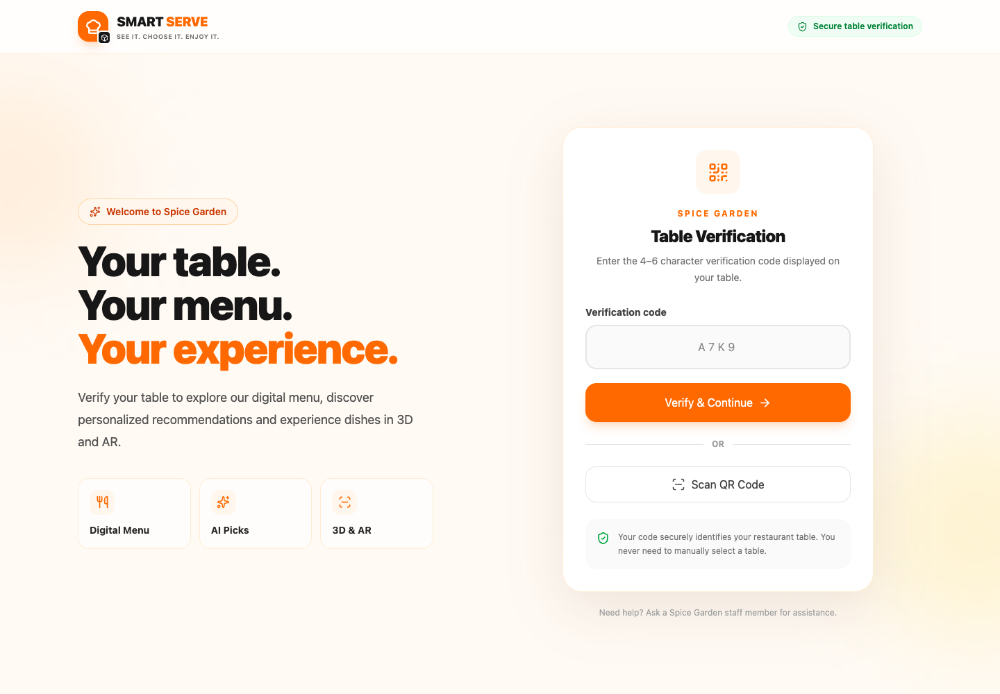
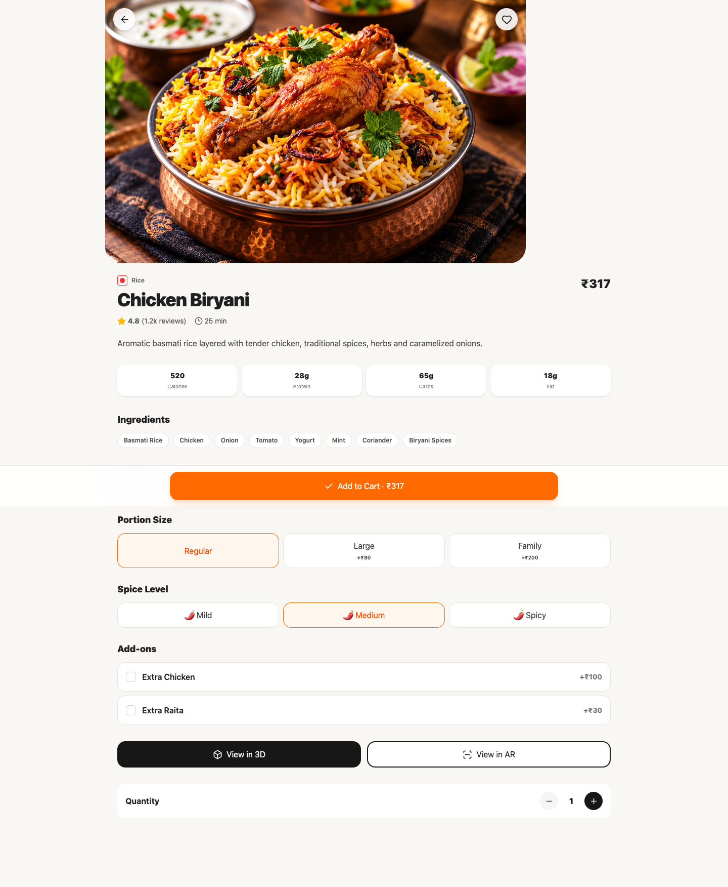
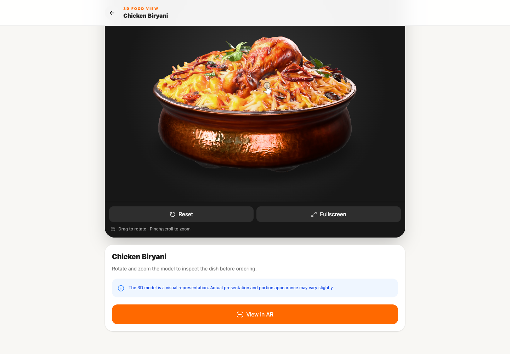
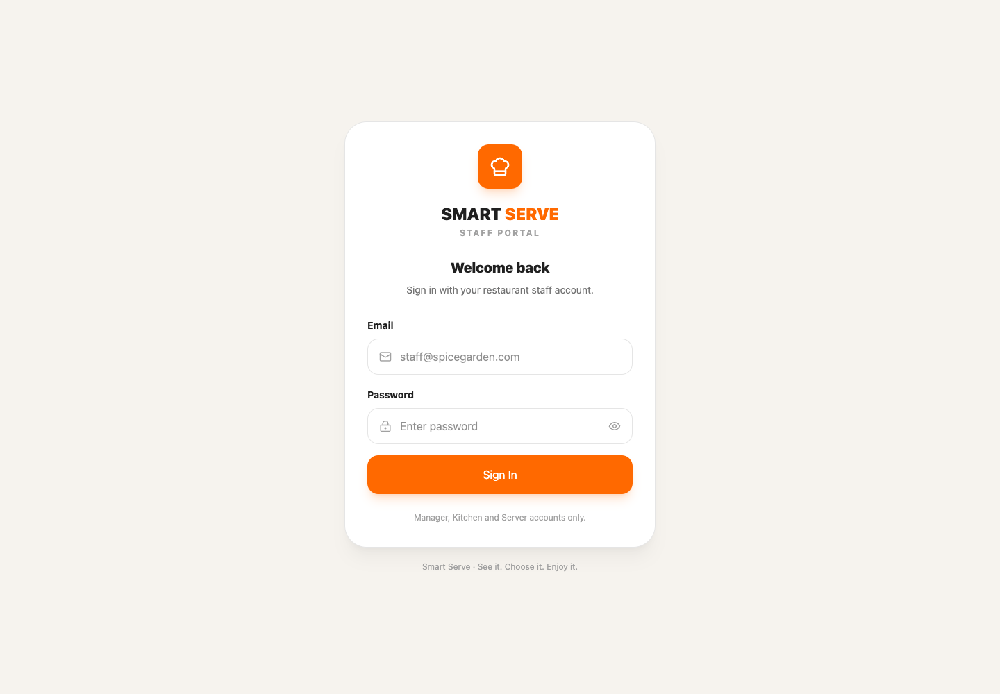
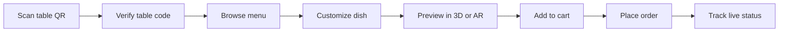
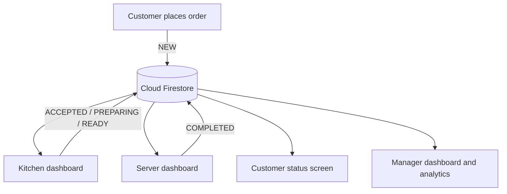

<div align="center">

# 🍽️ Smart Serve

### See it. Choose it. Enjoy it.

An immersive restaurant ordering platform that connects diners, kitchens, servers, and managers through one real-time workflow.

[](https://react.dev/)
[](https://www.typescriptlang.org/)
[](https://firebase.google.com/)
[](https://vite.dev/)
[](https://smart-serve-kb21.vercel.app/)

[Live application](https://smart-serve-kb21.vercel.app/) · [Customer journey](#customer-journey) · [Run locally](#run-locally)

</div>


## What is Smart Serve?

Smart Serve turns the complete dine-in journey into one connected digital experience. A customer scans the QR code at their table, verifies the table, explores a visual menu, customizes dishes, previews supported food in 3D or AR, places an order, and follows its status live.

The same order then appears in purpose-built workspaces for the kitchen, serving team, and restaurant manager. Firebase keeps menu, table, and order data synchronized, while role-protected routes keep each staff member in the right workspace.

## Why it stands out

- **Table-aware ordering** — QR links and verification codes bind the customer session to a restaurant table.
- **Immersive dish discovery** — supported dishes include interactive GLB models powered by Google `<model-viewer>` and device-dependent AR viewing.
- **Real-time operations** — Firestore subscriptions move an order through `NEW`, `ACCEPTED`, `PREPARING`, `READY`, and `COMPLETED` without a manual refresh.
- **Role-based staff tools** — separate manager, kitchen, and server experiences sit behind Firebase Authentication.
- **Responsive design** — the customer experience is comfortable on a phone while operations dashboards scale to larger screens.
- **Rich menu decisions** — search, category filters, nutritional details, portions, spice levels, add-ons, combos, favorites, and cart totals are built into the flow.

## Product tour

### Secure table entry

Customers begin with a QR link such as `/verify?table=table-12`. Smart Serve checks the entered code against an active Firestore table before creating a locally persisted dining session.



### Detailed, customizable dishes

Each dish can show its image, price, rating, preparation time, nutrition, ingredients, allergens, portion sizes, spice levels, and available add-ons before it reaches the cart.



### Interactive 3D and AR

GLB food assets can be rotated and zoomed in the browser. On compatible mobile devices, the same viewer can hand off to WebXR, Android Scene Viewer, or iOS Quick Look for an AR preview.



### Dedicated staff access

Firebase email/password authentication and Firestore staff profiles direct managers, kitchen staff, and servers to their permitted dashboards.



## Customer journey



## One order, four connected experiences



| Experience | What it provides |
| --- | --- |
| Customer | Table verification, live menu, search and categories, dish customization, 3D/AR, combos, cart, checkout, and live order tracking |
| Kitchen | Live queue filters, item and customization details, accept/reject controls, preparation state, and ready handoff |
| Server | Table overview, ready-order notifications, active order details, serving workflow, and payment overview |
| Manager | Operations overview, order and menu management, table QR/code controls, staff records, analytics, and a prototype 3D Model Studio |

## Technology

| Layer | Tools |
| --- | --- |
| UI | React 19, TypeScript, Tailwind CSS 4, Lucide React |
| Routing and state | React Router 7, Zustand 5, TanStack Query |
| Cloud | Firebase Authentication, Cloud Firestore, Firebase Storage client |
| 3D and AR | Google `<model-viewer>`, GLB/glTF, WebXR, Scene Viewer, Quick Look |
| Tooling and hosting | Vite 8, Oxlint, Vercel |

## Application routes

| Area | Route |
| --- | --- |
| Table verification | `/verify` |
| Customer menu and combos | `/menu`, `/combos` |
| Dish, 3D, and AR | `/dish/:id`, `/dish/:id/3d`, `/dish/:id/ar` |
| Cart and order tracking | `/cart`, `/order-confirmation`, `/order-status/:orderId` |
| Staff login | `/staff/login` |
| Kitchen and server | `/kitchen`, `/server` |
| Manager workspace | `/manager`, `/manager/orders`, `/manager/menu`, `/manager/tables`, `/manager/staff`, `/manager/analytics`, `/manager/models` |

## Project structure

```text
Smart_serve/
├── docs/screenshots/       # Product images used in this README
├── public/
│   ├── images/             # Dish photography
│   └── models/             # GLB food models
├── src/
│   ├── components/
│   │   ├── auth/           # Login and role guards
│   │   ├── common/         # Shared branding and UI
│   │   ├── customer/       # Ordering and immersive views
│   │   ├── kitchen/        # Kitchen order workflow
│   │   ├── manager/        # Restaurant administration
│   │   └── server/         # Table and serving workflow
│   ├── data/               # Seed/demo menu and table data
│   ├── services/           # Firebase and domain services
│   ├── store/              # Zustand application stores
│   └── types/              # Shared TypeScript models
├── package.json
├── vercel.json             # SPA route rewrite
└── vite.config.ts
```

## Run locally

### Prerequisites

- Node.js 20 or newer
- npm
- A Firebase project with Authentication and Firestore enabled

### 1. Clone and install

```bash
git clone https://github.com/thanushakr/Smart_serve.git
cd Smart_serve
npm install
```

### 2. Configure Firebase

Create a `.env` file in the project root:

```env
VITE_FIREBASE_API_KEY=your_api_key
VITE_FIREBASE_AUTH_DOMAIN=your_project.firebaseapp.com
VITE_FIREBASE_PROJECT_ID=your_project_id
VITE_FIREBASE_STORAGE_BUCKET=your_project.appspot.com
VITE_FIREBASE_MESSAGING_SENDER_ID=your_sender_id
VITE_FIREBASE_APP_ID=your_app_id
```

The repository ignores `.env` and other local environment files. Configure appropriate Firestore security rules before using real customer or restaurant data.

### 3. Start the application

```bash
npm run dev
```

Open `http://localhost:5173`. To test from a phone on the same network, run:

```bash
npm run dev -- --host
```

### 4. Validate a production build

```bash
npm run build
npm run lint
```

## Firebase data model

Smart Serve currently works with these main collections:

| Collection | Purpose |
| --- | --- |
| `restaurants` | Restaurant identity and seed marker |
| `tables` | Table number, active state, verification code, and operational status |
| `menuItems` | Dish content, pricing, availability, images, nutrition, and model URLs |
| `orders` | Customer session, table, line items, totals, status, and timestamps |
| `staff` | Authenticated staff profile, restaurant, active flag, and role |

## Implementation notes

- Recommended dishes currently use curated menu flags; there is no trained recommendation model in this repository.
- The Model Studio simulates the generation step and associates an existing GLB path with an uploaded preview. A production image-to-3D service is a future integration.
- Staff records shown in the manager interface are stored locally; Firebase Authentication accounts and Firestore staff profiles still need to be provisioned separately.
- AR support depends on the device, browser, model format, and secure HTTPS delivery. The normal 3D viewer remains available when AR is unsupported.
- The checked-in experience is configured for the demonstration restaurant ID `spice-garden`. Multi-restaurant tenancy would require moving that value into tenant-aware configuration and queries.

## Deployment

The app is deployed on Vercel at [smart-serve-kb21.vercel.app](https://smart-serve-kb21.vercel.app/). The included rewrite sends all routes to `index.html`, allowing React Router pages to open directly and survive refreshes.

Set the same Firebase environment variables in the Vercel project, then connect the repository to deploy pushes from the production branch.

## Roadmap

- Production image-to-3D generation and optimized model delivery
- Data-driven personalized recommendations
- Payment gateway and verified payment state
- Customer accounts and order history
- Push notifications for order updates
- Multi-restaurant tenancy
- Server-managed staff provisioning
- Progressive Web App and offline-friendly menu support
- Expanded automated tests and performance-focused code splitting

## Project status

Smart Serve is an educational, portfolio-ready prototype. Its customer menu, Firestore order workflow, authenticated role routing, operational dashboards, and checked-in 3D assets are implemented. The notes above distinguish simulated features from production integrations so contributors can extend the project with clear expectations.

<div align="center">

Built to make restaurant ordering more visual, connected, and enjoyable.

</div>
