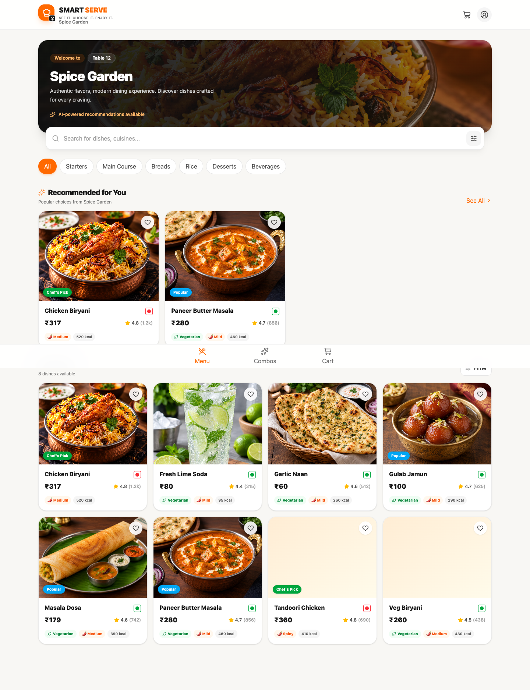
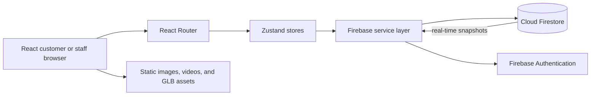
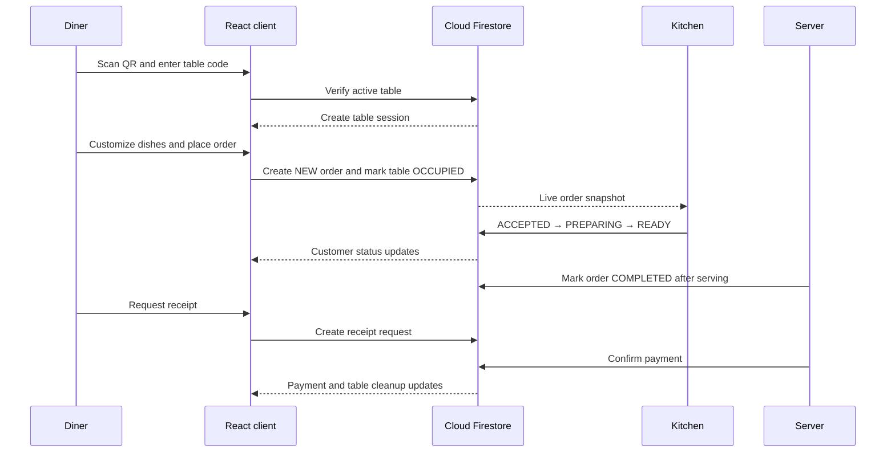

<div align="center">

# 🍽️ Smart Serve

### See it. Choose it. Enjoy it.

Smart Serve is a table-aware restaurant ordering platform for diners and restaurant teams. Customers scan a table QR code, explore a visual menu, customize dishes, place orders, request receipts, and follow progress while kitchen, server, and manager workspaces coordinate the same order in real time.

[](https://github.com/thanushakr/Smart_serve/actions/workflows/ci.yml)
[](https://react.dev/)
[](https://www.typescriptlang.org/)
[](https://firebase.google.com/)
[](https://vite.dev/)
[](#developer-experience-and-quality-control)
[](#governance-and-license)

[Live application](https://smart-serve-kb21.vercel.app/) · [Run locally](#installation) · [Customer journey](#end-to-end-execution-flow)

</div>



## Context and value proposition

Restaurant ordering is often fragmented between paper menus, verbal requests, kitchen queues, serving staff, and payment collection. Smart Serve gives each role one connected workflow while keeping the customer experience simple on a phone.

**Target users:** restaurant diners, kitchen staff, servers, and managers.

**Core value:** reduce ordering friction and give staff a shared, real-time view of tables, orders, preparation, service, and payment.

**Implemented capabilities:**

- QR/code-based table verification and table-bound customer sessions.
- Searchable menu with categories, portions, spice levels, add-ons, nutrition, favorites, combos, and a customer chatbot.
- Interactive 3D/AR previews for supported dishes with checked-in GLB assets.
- Cart and multi-round ordering for one active table session.
- Kitchen workflow: accept, prepare, mark ready, and complete orders with a live elapsed timer.
- Server workflow: table overview, ready-order notifications, receipt requests, and payment confirmation.
- Manager workflow: analytics, menu, table QR/code, staff, order, and prototype model management.
- Firebase Authentication and Firestore subscriptions for role-protected operations.

## Demo screenshots and media

| Area | Preview |
| --- | --- |
| Customer menu | [Open screenshot](docs/screenshots/customer-menu.png) |
| Table verification | [Open screenshot](docs/screenshots/table-verification.png) |
| Dish customization | [Open screenshot](docs/screenshots/dish-details.png) |
| 3D viewer | [Open screenshot](docs/screenshots/interactive-3d-viewer.png) |
| Staff login | [Open screenshot](docs/screenshots/staff-login.png) |

The deployed demo is available at [smart-serve-kb21.vercel.app](https://smart-serve-kb21.vercel.app/). The repository also includes two controls-free promotional videos in [`public/advertisements`](public/advertisements).

## Architecture and system design



The client is a Vite-built React single-page application. Customer and staff routes share domain stores, while `ProtectedRoute` checks the authenticated staff role before opening kitchen, server, or manager workspaces. Firestore is the source of truth for menu items, tables, staff profiles, orders, and receipt requests.

### Service boundaries

| Boundary | Responsibility |
| --- | --- |
| `components/customer` | Table verification, menu, cart, ordering, chatbot, 3D/AR, and status views |
| `components/kitchen` | Preparation queue and order status transitions |
| `components/server` | Table service, receipt notifications, and payment confirmation |
| `components/manager` | Restaurant operations, menu, staff, tables, orders, analytics, and models |
| `services` | Firebase initialization, table verification, menu access, auth, and model-generation prototype |
| `store` | Session, cart, menu, order, staff, auth, table, and model state |

## End-to-end execution flow



### Documentation links

- [Application routes](#application-routes)
- [Firebase data model](#firebase-data-model)
- [Live deployment](https://smart-serve-kb21.vercel.app/)
- API specification: not applicable; this repository is a client-side Firebase application and does not expose a standalone REST API or OpenAPI server.

## Technology stack

| Layer | Technology |
| --- | --- |
| UI | React 19, TypeScript 6, Tailwind CSS 4, Lucide React |
| Routing and state | React Router 7, Zustand 5, TanStack Query |
| Cloud | Firebase Authentication, Cloud Firestore, Firebase Storage client |
| Immersive content | Google `<model-viewer>`, GLB/glTF, WebXR, Scene Viewer, Quick Look |
| Build and hosting | Vite 8, npm, GitHub Actions, Vercel |

## Installation

### Prerequisites

- Node.js **20.x or newer** and npm.
- A Firebase project with Authentication and Cloud Firestore enabled.
- A modern browser. AR requires a compatible mobile browser and secure HTTPS delivery.
- No GPU is required. 3D/AR performance depends on the device and model size.

### Reproducible setup

```bash
git clone https://github.com/thanushakr/Smart_serve.git
cd Smart_serve
npm ci
cp .env.example .env
```

Create or update `.env` with the Firebase web-app values, then run:

```bash
npm run dev
```

Open <http://localhost:5173>. To test a phone on the same network:

```bash
npm run dev -- --host
```

Production validation:

```bash
npm run build
npm run lint
npm run preview
```

### Environment variables

| Key | Type | Required | Default | Description |
| --- | --- | --- | --- | --- |
| `VITE_FIREBASE_API_KEY` | string | Yes | none | Firebase web API key |
| `VITE_FIREBASE_AUTH_DOMAIN` | string | Yes | none | Firebase Authentication domain |
| `VITE_FIREBASE_PROJECT_ID` | string | Yes | none | Firebase project identifier |
| `VITE_FIREBASE_STORAGE_BUCKET` | string | Yes | none | Firebase Storage bucket |
| `VITE_FIREBASE_MESSAGING_SENDER_ID` | string | Yes | none | Firebase messaging sender ID |
| `VITE_FIREBASE_APP_ID` | string | Yes | none | Firebase web application ID |

Only `VITE_` values are exposed to the browser. Do not place service-account private keys, passwords, or admin credentials in `.env`. The checked-in `.env.example` is intentionally value-free.

## Application routes

| Area | Route |
| --- | --- |
| Table verification | `/verify` |
| Customer menu and combos | `/menu`, `/combos` |
| Dish, 3D, and AR | `/dish/:id`, `/dish/:id/3d`, `/dish/:id/ar` |
| Cart and order tracking | `/cart`, `/order-confirmation`, `/order-status/:orderId` |
| Staff login | `/staff/login` |
| Kitchen and server | `/kitchen`, `/server` |
| Manager workspace | `/manager`, `/manager/orders`, `/manager/menu`, `/manager/tables`, `/manager/staff`, `/manager/analytics`, `/manager/models` |

## Developer experience and quality control

### Useful commands

```bash
npm run dev       # Start Vite development server
npm run build     # Type-check and create production bundle
npm run lint      # Run Oxlint
npm run preview   # Serve the production bundle locally
```

The CI workflow runs `npm ci`, `npm run build`, and `npm run lint` on pushes and pull requests. There is currently no automated unit or end-to-end test suite, so the coverage badge is explicitly marked as not configured. Add tests under `src/**/*.test.*` and a test script before claiming coverage.

## Firebase data model

| Collection | Purpose |
| --- | --- |
| `restaurants` | Restaurant identity and seed marker |
| `tables` | Table number, active state, verification code, and operational status |
| `menuItems` | Dish content, pricing, availability, images, nutrition, and model URLs |
| `orders` | Customer session, table, line items, totals, status, payment, and timestamps |
| `staff` | Authenticated staff profile, restaurant, active flag, and role |

## Reliability, performance, and security

### Maturity and benchmarks

**Readiness: Beta / portfolio prototype.** The main customer and staff workflows are implemented, but production payment, automated test coverage, observability, and load testing are not complete. No formal latency or throughput benchmark has been published yet; performance should be measured against the target Firebase project and device mix before production rollout.

### Known limitations and troubleshooting

| Symptom | Likely cause | Resolution or trade-off |
| --- | --- | --- |
| Firebase initialization fails | Missing or incorrect `.env` values | Compare every key with `.env.example`, restart Vite, and verify the Firebase web app configuration |
| Orders are not visible to staff | Firestore rules or wrong `restaurantId` | Confirm staff auth, rules, and the demonstration ID `spice-garden` |
| AR button is unavailable | Browser/device/model support | Use the normal 3D viewer; AR requires compatible mobile hardware and HTTPS |
| Direct route refresh returns a 404 | Host is missing SPA fallback | Keep the included Vercel rewrite or configure the equivalent `index.html` fallback |
| Menu is empty | `menuItems` has not been seeded | Seed the restaurant menu from the manager workflow or Firestore setup |
| No test coverage report | Test suite is not configured yet | Run build and lint in CI; add unit/E2E tests before production readiness |

### Security reporting

Do not publish credentials, customer data, or exploit details in a public issue. For a suspected vulnerability, contact the repository maintainers privately through the GitHub organization account, include reproduction steps and impact, and allow time for a fix before public disclosure. Revoke any Firebase key accidentally committed and rotate affected credentials immediately.

## Governance and license

Contributions are welcome through focused branches and pull requests. Before opening a PR:

1. Keep changes scoped and explain the user-visible behavior.
2. Run `npm run build` and `npm run lint`.
3. Update README or screenshots when a workflow changes.
4. Never commit `.env`, service-account keys, or customer data.

Use two-space indentation, TypeScript types for shared data, existing Tailwind conventions, and clear component names. The default branch is protected by review and CI checks where configured.

**License:** No open-source license file has been declared yet. Until the maintainers add a license, all rights remain with the repository owner and reuse should be requested privately. Contributions are accepted under the repository owner’s review terms.

## Project structure

```text
Smart_serve/
├── .github/workflows/      # CI checks
├── docs/screenshots/       # README product images
├── public/                 # Dish images, ads, and GLB models
├── src/components/         # Customer, kitchen, server, manager, auth UI
├── src/data/               # Demo menu, categories, and table data
├── src/services/           # Firebase and domain services
├── src/store/              # Zustand stores
├── src/types/              # Shared TypeScript models
├── package.json
├── vercel.json             # SPA route rewrite
└── vite.config.ts
```

## Current implementation boundaries

- Recommendations and chatbot responses are curated client-side behavior; there is no trained recommendation model or external LLM service in this repository.
- Model Studio simulates image-to-3D generation and associates existing GLB assets; a production generation service is a future integration.
- Staff records and role provisioning require Firebase setup and are not a complete identity-management product.
- Payment confirmation is a staff workflow, not a payment gateway integration.
- The demonstration tenant is configured as `spice-garden`; multi-restaurant tenancy needs tenant-aware configuration and queries.

## Roadmap

- Payment gateway integration and verified payment webhooks.
- Automated unit, integration, and browser tests with coverage reporting.
- Data-driven recommendations and production chatbot integration.
- Push notifications, observability, and performance benchmarks.
- Multi-restaurant tenancy, staff provisioning, and offline-friendly PWA support.

<div align="center">

Built to make restaurant ordering more visual, connected, and enjoyable.

</div>
